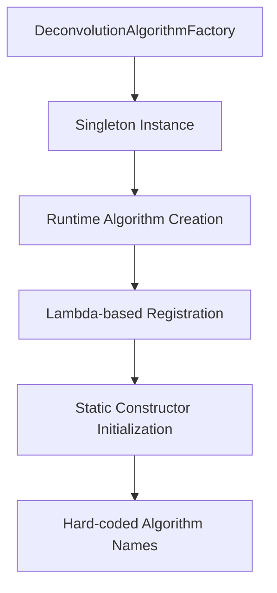
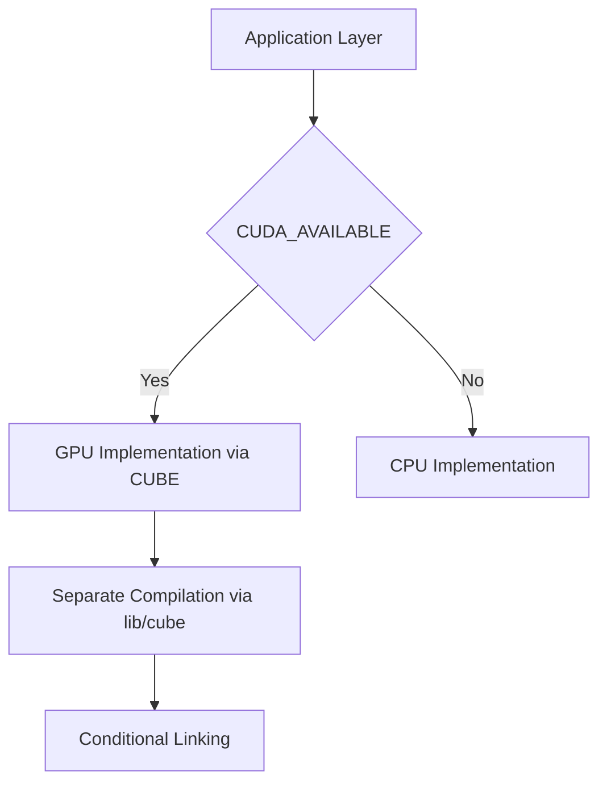
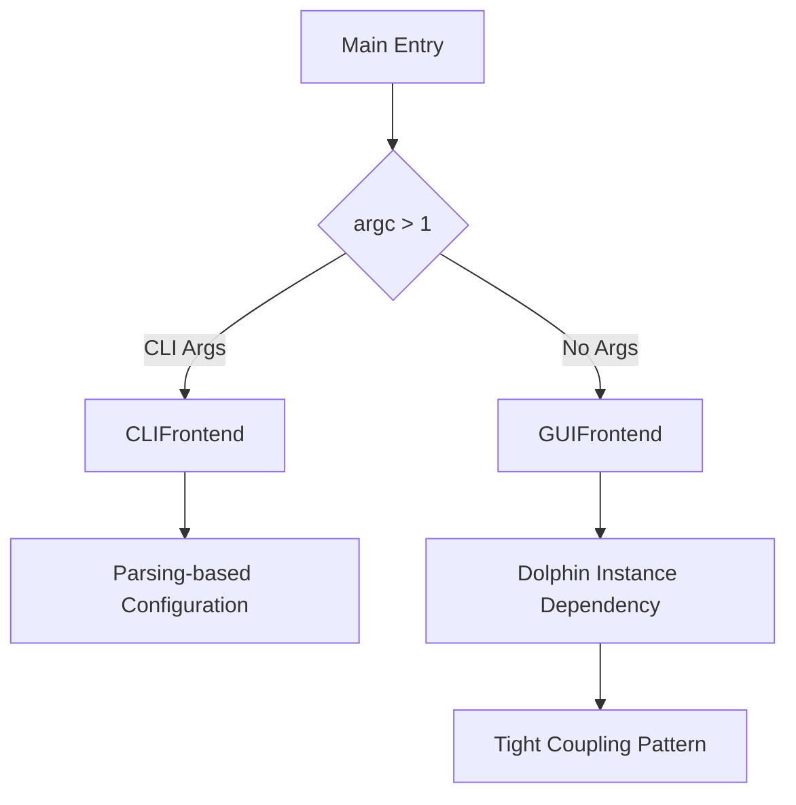
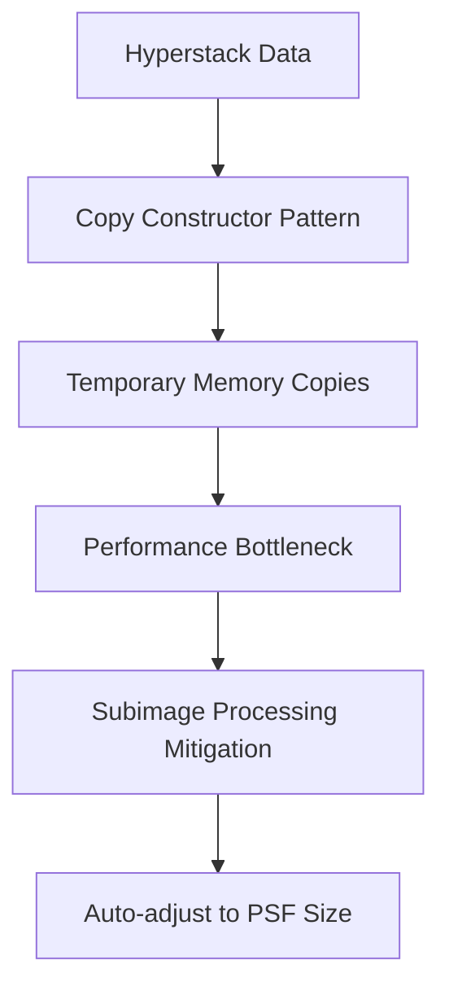
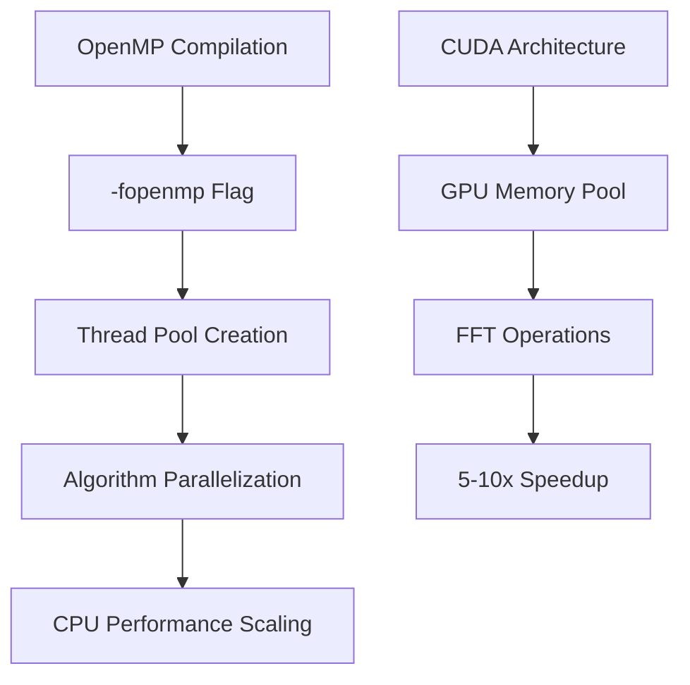
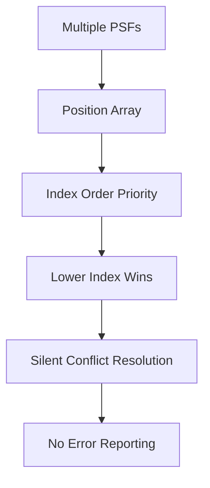
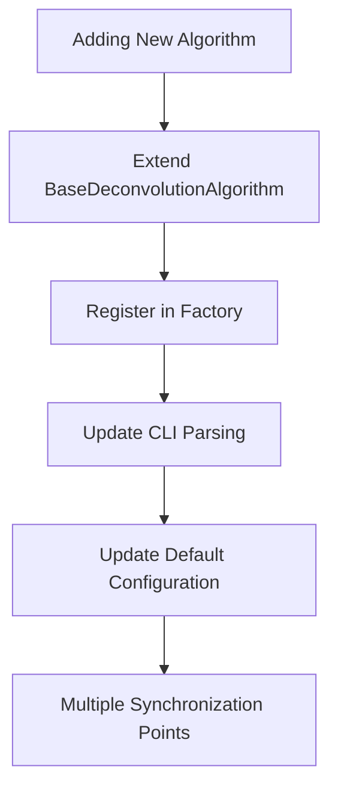

# Architect Mode Rules - DOLPHIN Project

## Architectural Decision Context

### System Architecture Overview
DOLPHIN follows a layered architecture with clear separation between scientific computing core and presentation layers. The system uses factory pattern extensively for algorithms and implements conditional compilation for GPU support. Key architectural constraint: the CUDA implementation is completely separate from CPU version, requiring architecture decisions that maintain API compatibility while supporting different performance characteristics.

### Core Design Tensions
1. **Performance vs Precision**: GPU version uses optimized kernels with different numerical precision
2. **Flexibility vs Complexity**: PSF system supports both global and position-specific application with complex conflict resolution
3. **Usability vs Control**: GUI/CLI duality requires maintaining two interfaces while keeping algorithm implementations unified
4. **Modularity vs Dependencies**: Factory pattern creates extensibility but requires careful dependency management

## Critical Architectural Patterns

### Configuration System Architecture
```mermaid
graph TD
    A[JSON Config] --> B[Config Base Class]
    B --> C[Template-based Parameter Loading]
    C --> D[Required: readParameter<T>()]
    C --> E[Optional: readParameterOptional<T>()]
    D --> F[Runtime Exception on Missing Required]
    E --> G[Silent Default for Optional]
```

**Key Insight**: Configuration paths are relative to executable, not project root, creating deployment risks not obvious from structure.

### Algorithm Factory Pattern


**Critical Constraint**: Adding algorithms requires updating BOTH factory registration AND CLI parsing - hidden coupling that violates clean architecture.

### GPU Integration Architecture


**Non-Obvious Dependency**: GPU architecture hard-coded to "75;80;90" creates hardware dependency not abstracted at application level.

### Frontend Architecture


**Architectural Risk**: GUI receives Dolphin instance directly, violating dependency inversion principle.

## Performance Architecture Patterns

### Memory Management Strategy


**Trade-off**: Subimage processing improves performance but creates complex PSF position mapping requirements.

### Parallelization Architecture


**Architectural Decision**: Performance optimized for specific GPU architectures reduces portability.

## Integration Architecture Patterns

### PSF Conflict Resolution Architecture


**Design Flaw**: Silent conflict resolution hides configuration errors from users.

### File I/O Architecture
```mermaid
graph TD
    A[Input Source] --> B{Extension Detection}
    B -->|.tif|. C[Single File Processing]
    B -->|Other| D[Directory Processing]
    D --> E[Multi-file TIFF Sequence]
    F[Output Path] --> G[Fixed Result Location]
    G --> H[../result/ Relative]
```

**Architectural Constraint**: Fixed output path creates deployment dependency not obvious from configuration.

## Quality Attribute Implications

### Maintainability Concerns
- Factory pattern creates hidden coupling between algorithm implementation and CLI parsing
- Configuration system uses template-based parameter loading creating complex compilation dependencies
- Hard-coded architecture constraints reduce cross-platform compatibility

### Performance Characteristics  
- GPU version provides significant speedup but creates precision differences
- OpenMP optimization relies on compiler-specific flags
- Memory fragmentation risks with large subimage arrays

### Security Considerations
- File path handling uses string manipulation without validation
- Configuration loading trusts JSON structure without schema validation
- GPU kernel compilation requires access to CUDA toolkit

## Architectural Evolution Patterns

### Extensibility Challenges


**Architectational Debt**: Process requires touching multiple components, violating single responsibility principle.

### Testing Architecture Limitations
No formal test architecture exists - testing relies on manual configuration files and expected output files. This creates challenges for:
- Regression testing algorithm changes
- Cross-platform compatibility verification  
- Performance regression detection

## Recommended Architectural Guidance

### When Extending System
1. **Algorithm Extensions**: Must modify factory, CLI parsing, and configurations - use abstract factory pattern to reduce coupling
2. **Configuration Extensions**: Maintain Config base class inheritance - avoid breaking template parameter requirements
3. **Frontend Extensions**: Abstract Dolphin dependency to allow testing and mocking

### Performance Optimization
1. **GPU Integration**: Consider unified memory abstraction to reduce CUDA-specific coupling
2. **Memory Management**: Implement move semantics for hyperstack operations
3. **Parallelization**: Consider TBB or C++17 parallel algorithms for better cross-platform support

### Quality Improvements
1. **PSF Validation**: Implement explicit conflict resolution with user feedback
2. **Configuration Validation**: Add JSON schema validation
3. **Testing Architecture**: Implement parameterized test framework with algorithmic testing