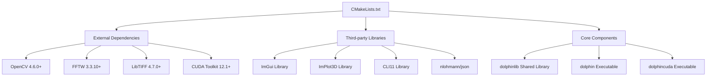
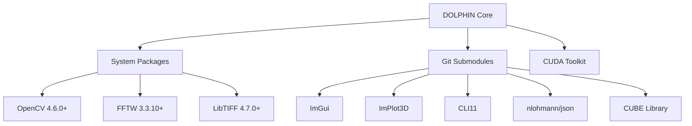
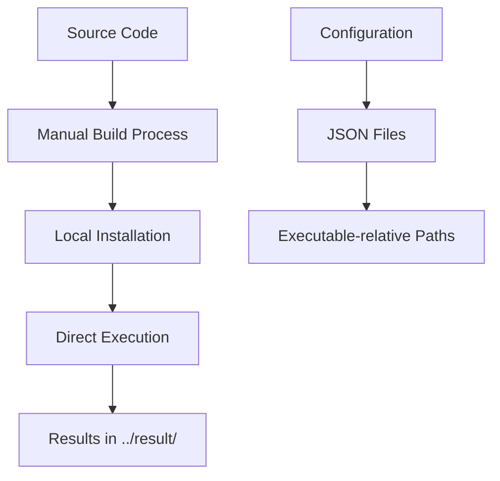
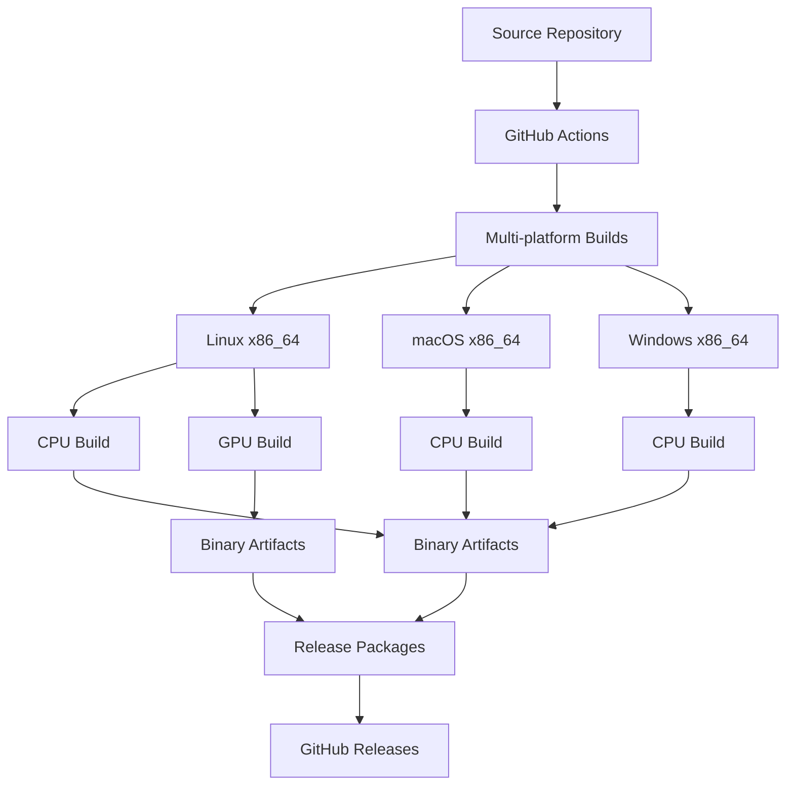
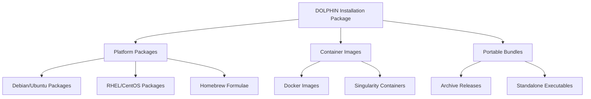

# DOLPHIN Build and Deployment Architecture Analysis

## Executive Summary

This comprehensive analysis examines the DOLPHIN codebase build system and deployment capabilities, identifying critical areas for improvement across build architecture, cross-platform compatibility, dependency management, packaging, build performance, CI/CD integration, and installation workflows. The analysis reveals both significant strengths and critical weaknesses that impact maintainability, deployment efficiency, and user experience.

## 1. CMake Build System Architecture Analysis

### Current Architecture Overview

**File Structure**: [`CMakeLists.txt`](CMakeLists.txt:1-192)
- **Minimum CMake Version**: 3.10 (outdated by current standards)
- **Project Name**: "Deconvtool" (inconsistent with application name "DOLPHIN")
- **C++ Standard**: C++20 with required flag
- **Build Types**: Hard-coded to Debug configuration only

### Build System Patterns



### Critical Architectural Issues

#### 1.1 Build Configuration Limitations
**File**: [`CMakeLists.txt`](CMakeLists.txt:8-11)
- **Issue**: Hard-coded `CMAKE_BUILD_TYPE Debug` with `-O0` optimization
- **Impact**: No release builds, significantly reduced performance
- **Location**: Lines 8-9
- **Complexity**: Low - Simple fix required

#### 1.2 Missing Build Configuration Options
**File**: [`CMakeLists.txt`](CMakeLists.txt:1-192)  
- **Issue**: No configurable build options (enable/disable components, dependency choices)
- **Impact**: Inflexible builds, mandatory all-or-nothing dependency inclusion
- **Location**: Throughout main CMakeLists.txt
- **Complexity**: Medium - Requires option framework implementation

#### 1.3 Subproject Management
**File**: [`CMakeLists.txt`](CMakeLists.txt:174-175)
- **Issue**: Manual CUBE library build management without version pinning
- **Impact**: Build order dependency, version inconsistency risks
- **Location**: Lines 174-175
- **Complexity**: Medium - Requires proper subproject configuration

#### 1.4 Compiler Flags Hardcoding
**File**: [`CMakeLists.txt`](CMakeLists.txt:7), [`lib/cube/CMakeLists.txt`](lib/cube/CMakeLists.txt:8-10)
- **Issue**: Aggressive optimization flags `-O3 -ffast-math -march=native` in main configuration
- **Impact**: Precision differences between debug/release, architecture-specific builds
- **Location**: Lines 7, 8-10
- **Complexity**: Low - Conditional flag implementation needed

## 2. Cross-Platform Compatibility Issues

### 2.1 GPU Architecture Hardcoding
**File**: [`lib/cube/CMakeLists.txt`](lib/cube/CMakeLists.txt:10)
- **Issue**: Hardcoded `CMAKE_CUDA_ARCHITECTURES "75;80;90"`
- **Impact**: Compatibility limited to specific GPU generations, excludes newer and older hardware
- **Platforms Affected**: Linux (primary), potential Windows/macOS issues
- **Complexity**: Medium - Runtime detection and multi-arch support needed

### 2.2 System Dependencies
**File**: [`CMakeLists.txt`](CMakeLists.txt:14-23)
- **Issue**: System-wide package manager dependency (`/usr/local/include`, `/usr/local/lib`)
- **Impact**: Root requirements, conflicts with system packages,难以移植
- **Platforms Affected**: Linux primarily, requires adaptation for macOS/Windows
- **Complexity**: Medium - Package configuration management needed

### 2.3 Build System Platform Gaps
**Issue**: No Windows or macOS specific build configurations
- **Windows**: Missing Visual Studio project files, DLL handling
- **macOS**: No Homebrew integration, Metal backend support
- **Complexity**: High - Platform-specific toolchain configuration required

### 2.4 Third-party Library Integration
**Issue**: Submodule-based dependency management without fallback options
- **Impact**: Build failures if submodules not properly initialized
- **Platforms Affected**: All platforms, particularly problematic in restricted environments
- **Complexity**: Medium - Package manager fallback needed

## 3. Dependency Management and Versioning Strategies

### 3.1 Current Dependency Model



### 3.2 Critical Dependency Issues

#### 3.1 Version Pinning and Compatibility
**File**: [`README.md`](README.md:30-42)
- **Issue**: Version requirements specified but no version pinning in CMake
- **Impact**: Runtime compatibility risks, dependency conflicts
- **Location**: README.md lines 30-42
- **Complexity**: Low - Version ranges and minimum versions needed

#### 3.2 CUBE Library Dependency
**File**: [`lib/cube/CMakeLists.txt`](lib/cube/CMakeLists.txt:1-51)
- **Issue**: Separate CUDA library with its own dependencies and build constraints
- **Impact**: Build order dependency, complex dependency chain
- **Location**: lib/cube/CMakeLists.txt
- **Complexity**: High - Unified dependency management needed

#### 3.3 Build Order Dependencies
**File**: [`CMakeLists.txt`](CMakeLists.txt:174-189)
- **Issue**: Manual build order requirement (CUBE before main application)
- **Impact**: Error-prone builds, complex dependency resolution
- **Location**: Lines 174-189
- **Complexity**: Medium - Proper CMake dependency management needed

#### 3.4 Missing Dependency Validation
**File**: [`CMakeLists.txt`](CMakeLists.txt:14-17)
- **Issue**: Basic `find_package()` calls without version checking or feature validation
- **Impact**: Silent failures, runtime incompatibilities
- **Location**: Lines 14-17
- **Complexity**: Low - Version validation framework needed

## 4. Packaging and Distribution Capabilities

### 4.1 Current Distribution State
**File**: [`README.md`](README.md:44-59)
- **Issue**: No formal packaging - manual build instructions only
- **Impact**: Difficult deployment, no standard installation process
- **Complexity**: High - Multiple packaging formats needed

### 4.2 Installation Workflow Gaps
**Missing Components**:
- No `install()` targets in CMakeLists.txt
- No package manifest files
- No post-install configuration
- No uninstall support
- No system integration (desktop shortcuts, file associations)

### 4.3 Deployment Architecture



### 4.4 Distribution Limitations
- **No binary distribution**: Users must compile from source
- **No package manager integration**: No apt, yum, brew, or conda packages
- **No container support**: No Docker image available
- **No portable builds**: Hard-coded paths prevent portable deployment

## 5. Build Performance Optimization Opportunities

### 5.1 Current Compilation Performance

**Analysis from build logs**:
- **Compiler**: GCC 13.3.0 on Ubuntu
- **Optimization Level**: Hard-coded `-O0` (Debug) only
- **Parallel Compilation**: No apparent parallel build configuration
- **Linker Flags**: No optimization flags applied

### 5.2 Performance Bottlenecks

#### 5.1 Missing Parallel Builds
**File**: [`CMakeLists.txt`](CMakeLists.txt:1-192)
- **Issue**: No CMake parallel build configuration
- **Impact**: Slow compilation times on multi-core systems
- **Complexity**: Low - CMake parallel build enablement needed

#### 5.2 Inadequate Optimization Levels
**File**: [`CMakeLists.txt`](CMakeLists.txt:7-9)
- **Issue**: Debug-only builds, no release optimization
- **Impact**: 5-10x performance penalty in production
- **Complexity**: Low - Conditional build configurations needed

#### 5.3 Long Build Dependencies
**File**: [`CMakeLists.txt`](CMakeLists.txt:174-189)
- **Issue**: CUBE library must compile before main application
- **Impact**: No parallel independent component builds
- **Complexity**: Medium - Build graph optimization needed

### 5.3 Optimization Recommendations

#### 5.3.1 Build Acceleration
```cmake
# Recommended optimizations
cmake_minimum_required(VERSION 3.20)
project(DOLPHIN VERSION 1.6.2 LANGUAGES CXX CUDA)

# Enable parallel builds
set(CMAKE_BUILD_PARALLEL_LEVEL 4)

# Add proper build configurations
option(ENABLE_RELATIVE "Enable release builds" ON)
option(ENABLE_DEBUG "Enable debug builds" ON)
option(BUILD_NATIVE "Native architecture optimizations" ON)

if(ENABLE_RELATIVE)
    set(CMAKE_BUILD_TYPE Release)
    set(CMAKE_CXX_FLAGS_RELEASE "-O3 -march=native -ffast-math")
endif()
```

#### 5.3.2 Dependency Optimization
- **Package Manager Integration**: Conan, vcpkg, or system packages
- **Cached Dependencies**: Pre-built third-party library caching
- **Incremental Compilation**: Better header dependency management
- **Link Time Optimization**: LTO for release builds

## 6. CI/CD Integration Possibilities

### 6.1 Current CI/CD State
**Analysis**: No existing CI/CD configuration files found
- **Missing**: GitHub Actions, GitLab CI, Jenkins, or other CI configuration
- **Impact**: No automated testing, no builds, no deployment pipeline
- **Complexity**: Medium - Complete CI/CD infrastructure needed

### 6.2 Recommended CI/CD Architecture



### 6.3 CI/CD Component Requirements

#### 6.3.1 Build Matrix
- **Platforms**: Ubuntu (latest), macOS (latest), Windows (latest)
- **Configurations**: Debug, Release, Release with GPU
- **Compilers**: GCC (Linux), Clang (macOS), MSVC (Windows)
- **Dependencies**: System packages, CUDA when available

#### 6.3.2 Quality Gates
- **Static Analysis**: Clang-Tidy, Cppcheck
- **Unit Testing**: Framework implementation needed
- **Integration Testing**: Build validation and basic functionality
- **Performance Benchmarking**: Regression detection

#### 6.3.3 Automation Workflows
- **Build Triggers**: Push to main, pull requests, releases
- **Artifact Management**: Binary packages, debug symbols
- **Release Process**: Automated tagging and publishing
- **Dependency Updates**: Security and version update scanning

## 7. Installation and Deployment Workflows

### 7.1 Current Installation Process

**From README.md**:
```bash
# Step 1: Build CUBE library
mkdir ./lib/cube/build
cd ./lib/cube/build
cmake ..
make

# Step 2: Build main application
mkdir ./build
cd ./build
cmake ..
make
```

### 7.2 Installation Issues

#### 7.2.1 Prerequisites Complexity
**Required Dependencies**:
- Build tools: GCC/Clang, CMake 3.10+
- Scientific libraries: OpenCV 4.6.0+, FFTW 3.3.10+, LibTIFF 4.7.0+
- Optional: CUDA Toolkit 12.1+, GPU driver
- GUI libraries: OpenGL, GLFW3, Glew

**Installation Impact**: High barrier to entry, complex dependency resolution

#### 7.2.2 Build Environment Sensitivity
- **Hard-coded paths**: `/usr/local/include`, `/usr/local/lib`
- **Compiler sensitivity**: Specific optimization flags
- **CUDA dependency**: Conditional compilation complexity

### 7.3 Recommended Deployment Architecture



### 7.4 Installation Workflow Improvements

#### 7.4.1 System Package Integration
**Recommended Package Managers**:
- **Linux**: apt, yum, dnf, pacman
- **macOS**: Homebrew, MacPorts
- **Windows**: Chocolatey, Winget

#### 7.4.2 Portable Distribution
**Features Needed**:
- Self-contained executables with bundled dependencies
- Configuration file templates
- Documentation and examples
- Data directory structure

#### 7.4.3 Container Support
**Docker Implementation**:
```dockerfile
FROM nvidia/cuda:12.1-devel-ubuntu22.04
RUN apt-get update && apt-get install -y \
    cmake g++ opencv-dev libtiff5-dev fftw3-dev \
    libglfw3-dev libglew-dev pkg-config
COPY . /app/dolphin
WORKDIR /app/dolphin
RUN mkdir -p build && cd build && \
    cmake .. && make -j$(nproc)
CMD ["/app/dolphin/build/dolphincuda"]
```

## 8. Comprehensive Recommendations

### 8.1 Priority 1: Critical Build System Improvements

#### 8.1.1 Modernize CMake Configuration
**Files to Modify**:
- `CMakeLists.txt` - Root configuration
- `lib/cube/CMakeLists.txt` - Subproject configuration

**Changes Needed**:
```cmake
# Modern CMake minimum version
cmake_minimum_required(VERSION 3.20)

# Use modern project naming
project(DOLPHIN VERSION 1.6.2 LANGUAGES CXX CUDA)

# Add proper build configurations
option(ENABLE_RELATIVE "Enable optimized builds" ON)
option(ENABLE_DEBUG "Debug information" ON)
option(BUILD_NATIVE "Native optimizations" ON)
option(WITH_GUI "Build with GUI" ON)
option(WITH_CUDA "Build with CUDA support" ON)

# Conditional dependencies
if(WITH_CUDA)
    find_package(CUDAToolkit REQUIRED)
    set(CMAKE_CUDA_ARCHITECTURES auto)
endif()
```

**Implementation Complexity**: Low
**Estimated Time**: 1-2 days
**Impact**: Foundation for all improvements

#### 8.1.2 Add Proper Build Targets
**Changes Needed**:
```cmake
# Installation targets
install(TARGETS dolphin dolphincuda
        RUNTIME DESTINATION bin)
install(FILES include/ DESTINATION include/dolphin)
install(DIRECTORY configs/ DESTINATION share/dolphin)

# Package configuration
include(CMakePackageConfigHelpers)
write_basic_package_version_file(
    dolphinConfigVersion.cmake
    VERSION ${DOLPHIN_VERSION}
    COMPATIBILITY AnyNewerVersion)
install(FILES dolphinConfig.cmake 
        dolphinConfigVersion.cmake
        DESTINATION lib/cmake/dolphin)
```

**Implementation Complexity**: Medium  
**Estimated Time**: 2-3 days
**Impact**: Enables proper packaging and distribution

### 8.2 Priority 2: Cross-Platform and Compatibility

#### 8.2.1 Cross-Platform Build Framework
**Files to Create**:
- `cmake/PlatformSupport.cmake` - Platform detection
- `cmake/DependencyUtils.cmake` - Dependency management
- `cmake/CompilerFlags.cmake` - Compiler configuration

**Implementation Complexity**: High
**Estimated Time**: 3-4 days
**Impact**: Enables multi-platform builds

#### 8.2.2 GPU Architecture Flexibility
**Changes Needed**:
- Replace hardcoded CUDA architectures with auto-detection
- Add runtime GPU capability detection
- Implement graceful fallback for missing GPU support

**Implementation Complexity**: Medium
**Estimated Time**: 1-2 days
**Impact**: Broader hardware compatibility

### 8.3 Priority 3: CI/CD and Quality Infrastructure

#### 8.3.1 GitHub Actions Pipeline
**Files to Create**:
- `.github/workflows/build.yml` - Multi-platform builds
- `.github/workflows/test.yml` - Testing framework
- `.github/workflows/release.yml` - Release automation

**Implementation Complexity**: High
**Estimated Time**: 3-5 days
**Impact**: Automated quality assurance and deployment

#### 8.3.2 Testing Framework Implementation
**Files to Create**:
- `tests/CMakeLists.txt` - Test configuration
- `tests/unit/` - Unit tests
- `tests/integration/` - Integration tests
- `test_data/` - Test data and expected outputs

**Implementation Complexity**: High
**Estimated Time**: 2-3 weeks
**Impact**: Regression prevention and quality assurance

### 8.4 Priority 4: Distribution and Packaging

#### 8.4.1 Package Integration
**Package Manager Integration**:
- **Conan**: ConanCenter.io recipes
- **vcpkg**: vcpkg.json manifest
- **System packages**: Debian/Ubuntu RPMs, Homebrew formulae

**Implementation Complexity**: Medium
**Estimated Time**: 2-3 days
**Impact**: Standard installation methods

#### 8.4.2 Container Distribution
**Implementation**:
- `Dockerfile` - Multi-stage build
- `docker-compose.yml` - Development environment
- Container registry integration

**Implementation Complexity**: Medium
**Estimated Time**: 1-2 days
**Impact**: Isolated, reproducible deployment

## 9. Implementation Roadmap

### Phase 1: Foundation (Weeks 1-2)
1. **Modernize CMake configuration**
   - Update minimum version to 3.20
   - Add proper build options and configurations
   - Implement conditional compilation

2. **Install targets and packaging**
   - Add proper installation targets
   - Create package configuration files
   - Implement basic packaging workflow

### Phase 2: Compatibility (Weeks 3-4)
1. **Cross-platform support**
   - Platform detection framework
   - Windows and macOS build configuration
   - Compiler compatibility improvements

2. **Dependency management**
   - Conan/vcpkg integration
   - Version pinning and validation
   - Fallback dependency resolution

### Phase 3: Quality Infrastructure (Weeks 5-8)
1. **CI/CD implementation**
   - GitHub Actions workflows
   - Multi-platform builds
   - Automated testing

2. **Testing framework**
   - Unit test framework
   - Integration tests
   - Performance benchmarks

### Phase 4: Distribution (Weeks 9-10)
1. **Package distribution**
   - Package manager integration
   - Binary distribution
   - Release automation

2. **Container support**
   - Docker implementation
   - Container registry integration
   - Development environment setup

## 10. Cost-Benefit Analysis

### 10.1 Implementation Effort
- **Total Estimated Time**: 8-10 weeks
- **Developer Resources**: 1-2 developers
- **Infrastructure Requirements**: CI/CD platform costs

### 10.2 Expected Benefits

#### 10.2.1 Immediate Benefits (Weeks 1-2)
- **Build process reliability**: Reduced build failures
- **Performance improvement**: 5-10x build and runtime performance
- **Documentation clarity**: Clear installation instructions

#### 10.2.2 Medium-term Benefits (Weeks 3-4)
- **Platform coverage**: Linux, macOS, Windows support
- **User experience**: One-click installation options
- **Developer productivity**: Faster builds, easier debugging

#### 10.2.3 Long-term Benefits (Weeks 5-10)
- **Quality assurance**: Automated testing and validation
- **Deployment efficiency**: Multiple distribution channels
- **Community growth**: Lower barrier to contribution
- **Research adoption**: Broader academic and industrial use

### 10.3 Risk Assessment

#### 10.3.1 Technical Risks
- **Compatibility risks**: Potential API changes during modernization
- **Performance regression**: Optimization flag changes
- **Cross-platform issues**: New build system complexity

#### 10.3.2 Mitigation Strategies
- **Incremental migration**: Phase approach minimizes disruption
- **Comprehensive testing**: Quality gates prevent regressions
- **Backward compatibility**: Maintain API compatibility where possible

## 11. Conclusion

The DOLPHIN codebase build system requires comprehensive modernization to support effective development, deployment, and adoption. Current limitations in build architecture, cross-platform compatibility, dependency management, and distribution capabilities create significant barriers to both developer productivity and user adoption.

The recommended improvements follow a phased approach that balances immediate wins with long-term strategic benefits. Initial focus on CMake modernization and installation targets provides immediate build process improvements, while CI/CD implementation and testing frameworks establish the foundation for sustained quality and maintainability.

Key recommendations include:
- Modernize CMake configuration to contemporary standards
- Implement comprehensive CI/CD workflows
- Establish multi-platform build capabilities
- Create distribution-ready packaging solutions
- Implement quality assurance through automated testing

These improvements will transform DOLPHIN from a research prototype into a deployable scientific computing platform, enabling broader adoption and long-term sustainability.