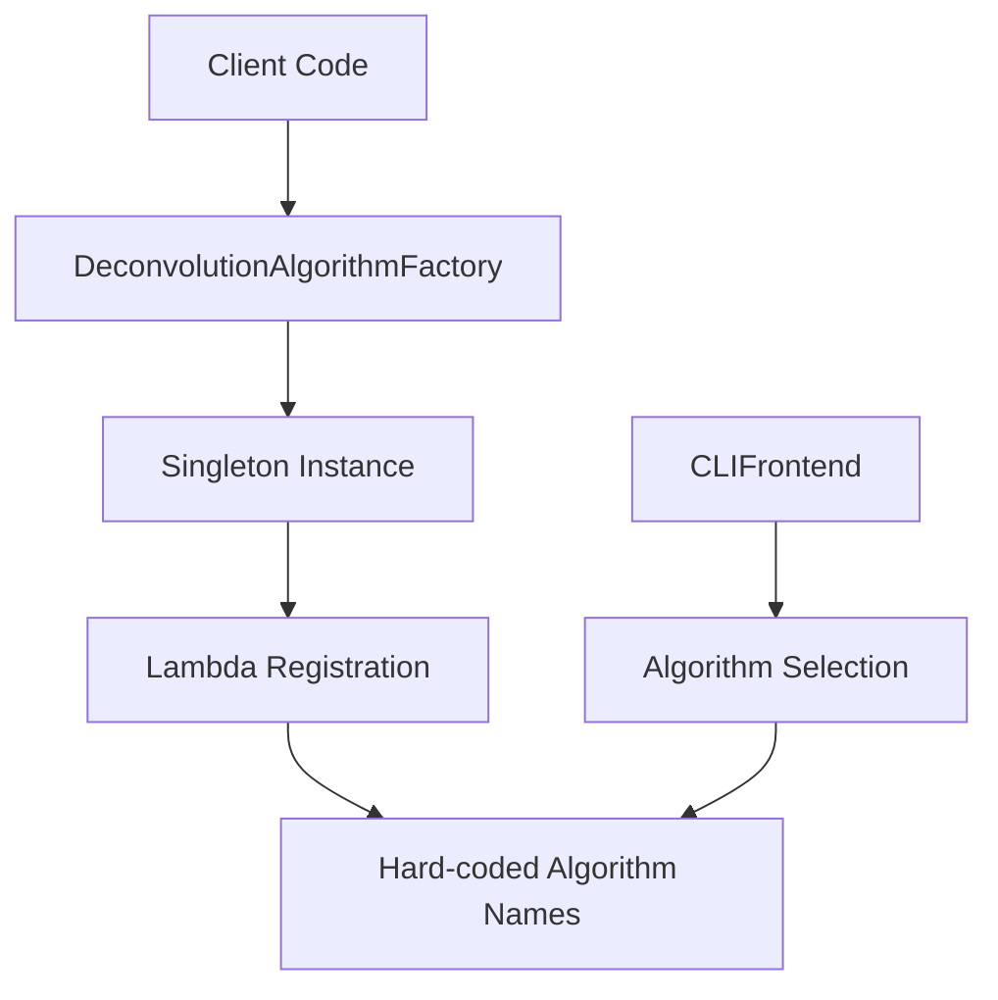
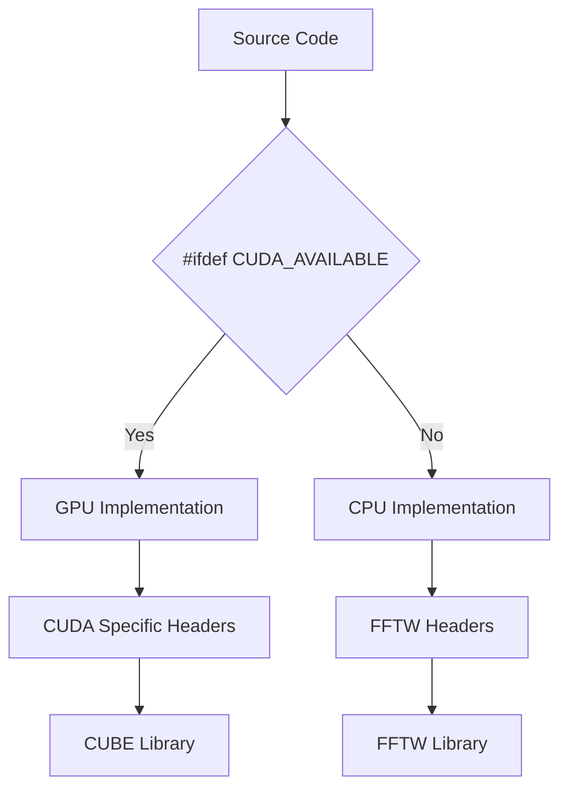
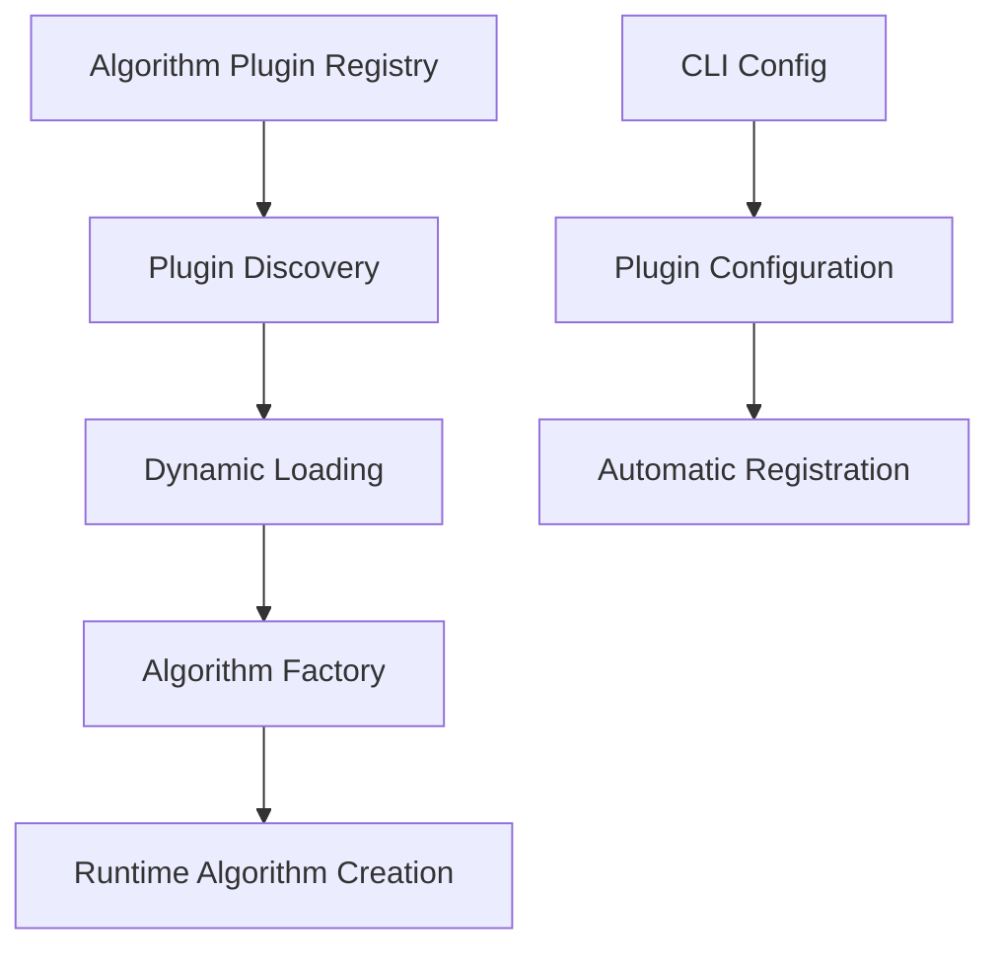
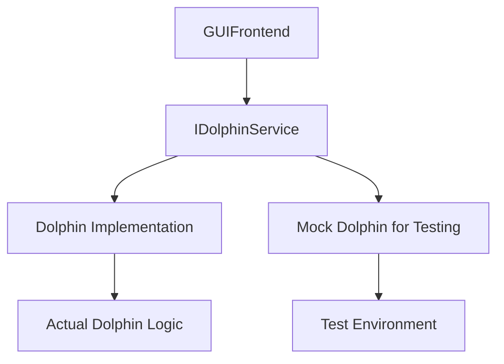
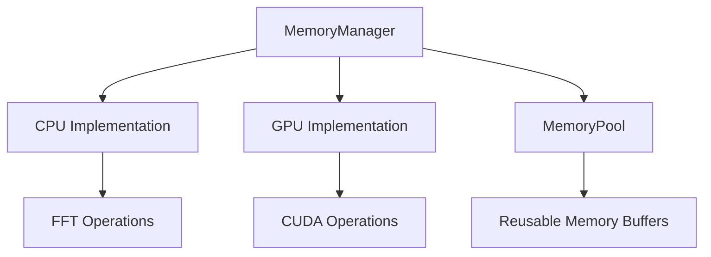
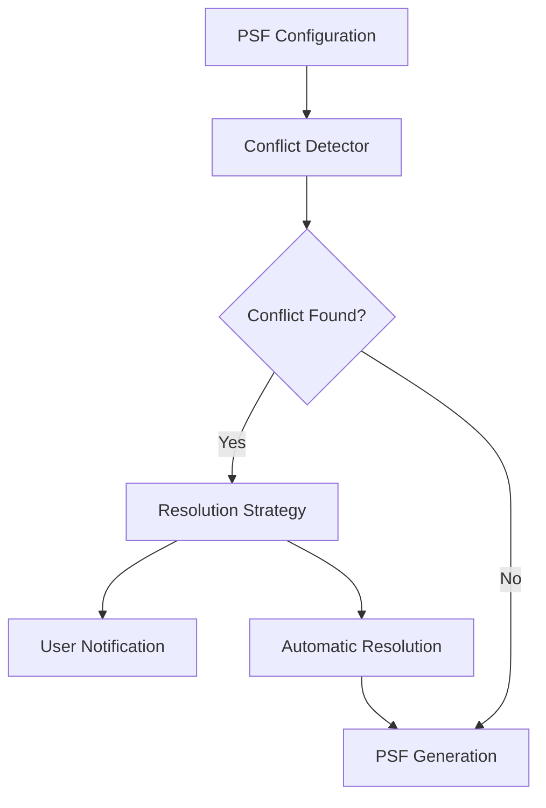
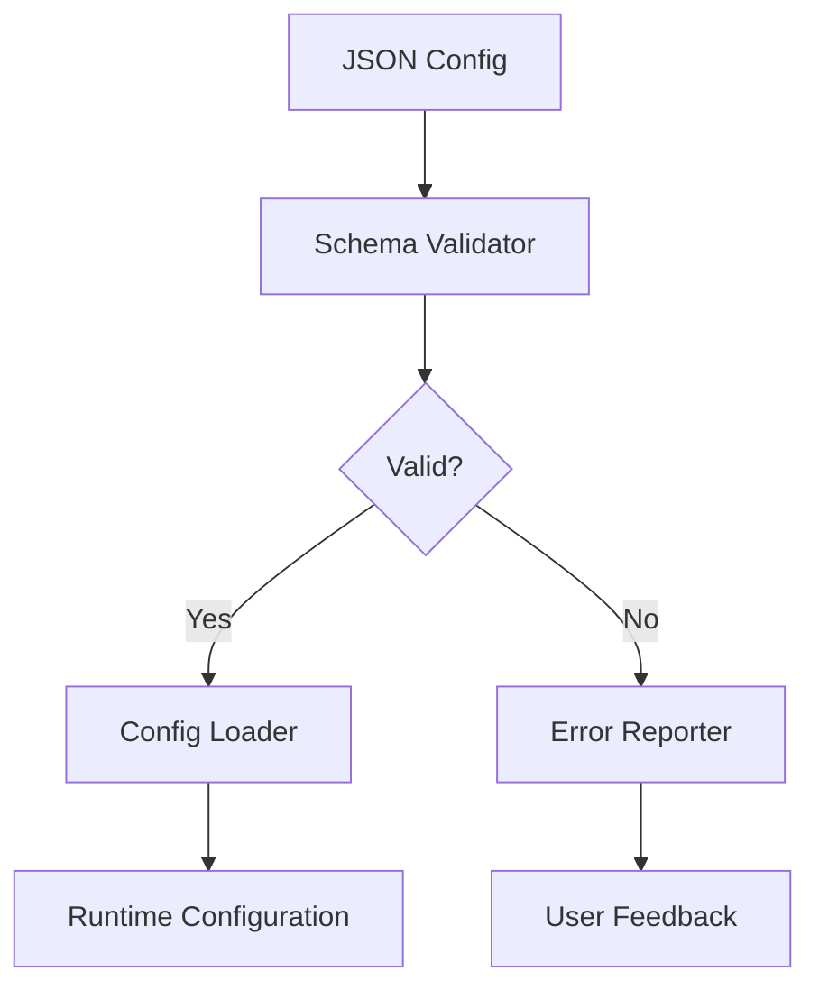
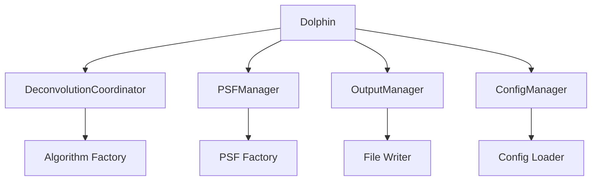
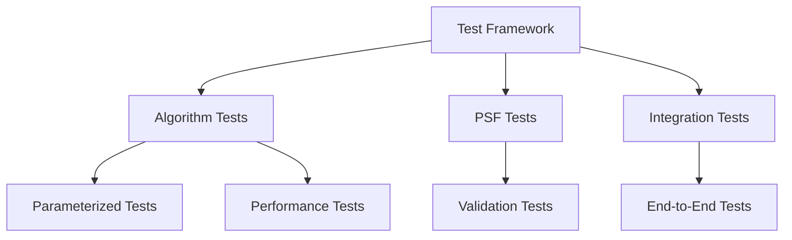

# DOLPHIN Codebase Architecture Analysis and Recommendations

## Executive Summary

This document provides a comprehensive architectural analysis of the DOLPHIN (Deconvolution with Optimized Local PSFs for High-speed Image recoNstruction) scientific computing application. The analysis reveals significant architectural strengths in separation of concerns and factory pattern usage, but also identifies critical weaknesses in coupling, maintainability, and extensibility that should be addressed to ensure long-term viability.

## Current Architecture Patterns

### 1. Factory Pattern Implementation

**Current State:**
- **Algorithm Factory**: [`DeconvolutionAlgorithmFactory`](include/DeconvolutionAlgorithmFactory.h:13) implements singleton pattern with lambda-based registration
- **PSF Factory**: [`PSFGeneratorFactory`](include/psf/PSFGeneratorFactory.h:18) provides dual creator functions for generators and configs
- **Strengths**: Extensible runtime algorithm/PSF creation, clear interface separation
- **Weaknesses**: Hidden coupling between factory registration and CLI parsing

**Architecture Pattern:**

### 2. Configuration System Architecture

**Current State:**
- **Base Class**: [`Config`](include/Config.h:7) provides template-based parameter loading
- **Inheritance**: [`DeconvolutionConfig`](include/DeconvolutionConfig.h:7) and [`PSFConfig`](include/psf/configs/PSFConfig.h) inherit from base
- **Template Loading**: [`readParameter<T>()`](include/Config.h:14) for required fields, [`readParameterOptional<T>()`](include/Config.h:23) for optional
- **Critical Issue**: Configuration paths relative to executable, not project root

### 3. Frontend/Backend Separation

**Current State:**
- **Interface**: [`IFrontend`](include/frontend/IFrontend.h:4) defines common interface
- **CLI Implementation**: [`CLIFrontend`](include/frontend/CLIFrontend.h:7) handles argument parsing
- **GUI Implementation**: [`GUIFrontend`](include/frontend/gui/GUIFrontend.h:11) directly depends on [`Dolphin`](include/Dolphin.h:18) instance
- **Architecture Violation**: GUI tight coupling violates dependency inversion principle

### 4. Layered Architecture

**Current State:**
- **Presentation Layer**: Frontend components (GUI/CLI)
- **Application Layer**: [`Dolphin`](include/Dolphin.h:18) coordinates operations
- **Domain Layer**: Deconvolution algorithms and PSF generators
- **Infrastructure Layer**: File I/O, FFT operations, GPU integration

## Architectural Weaknesses

### 1. Tight Coupling Issues

**Factory-CLI Coupling:**
- **Location**: [`DeconvolutionAlgorithmFactory`](include/DeconvolutionAlgorithmFactory.h:48-64) registration and [`CLIFrontend`](include/frontend/CLIFrontend.h) parsing
- **Problem**: Adding new algorithms requires changes to multiple components
- **Impact**: Violates single responsibility principle, increases regression risk

**Frontend Backend Coupling:**
- **Location**: [`GUIFrontend`](include/frontend/gui/GUIFrontend.h:38) directly depends on [`Dolphin`](include/Dolphin.h:18)
- **Problem**: Cannot test GUI independently, violates dependency inversion
- **Impact**: Difficult to maintain, test, or replace frontend

**GPU-CPU Conditional Compilation:**
- **Location**: [`BaseDeconvolutionAlgorithm`](include/BaseDeconvolutionAlgorithm.h:8-12) uses conditional compilation
- **Problem**: Code duplication, complex memory management, precision differences
- **Impact**: Maintenance burden across two implementation paths

### 2. Single Responsibility Violations

**PSFManager Class:**
- **Location**: [`PSFManager`](include/PSFManager.h:20)
- **Issues**: 
  - Handles JSON loading, PSF generation, file I/O, and configuration validation
  - Violates single responsibility principle (comment: "this thing is a mess")
  - 40+ lines with multiple responsibilities

**Dolphin Class:**
- **Location**: [`Dolphin`](include/Dolphin.h:18)
- **Issues**:
  - Manages configuration, PSF generation, deconvolution, and output saving
  - Monolithic class difficult to test and maintain
  - Should be split into separate coordinators

### 3. Scalability Concerns

**Memory Management:**
- **Location**: [`BaseDeconvolutionAlgorithm`](include/BaseDeconvolutionAlgorithm.h:38-67)
- **Issues**:
  - Complex memory management with multiple pointer arrays
  - No RAII patterns for FFTW plans
  - Risk of memory leaks with complex PSF arrangements

**Thread Safety:**
- **Location**: [`DeconvolutionAlgorithmFactory`](include/DeconvolutionAlgorithmFactory.h:17-20) singleton
- **Issues**: No thread safety guarantees for concurrent algorithm creation
- **Impact**: Cannot safely use in multi-threaded environments

### 4. Extensibility Limitations

**Registration Complexity:**
- **Location**: Factory registration patterns in [`DeconvolutionAlgorithmFactory`](include/DeconvolutionAlgorithmFactory.h:50-64) and [`PSFGeneratorFactory`](include/psf/PSFGeneratorFactory.h:101-109)
- **Problem**: Manual registration required for new algorithms/PSFs
- **Impact**: Extension requires touching multiple files, violates open/closed principle

## GPU/CPU Architecture Analysis

### Current Implementation

**Separate Compilation:**
- CPU version: Built via [`CMakeLists.txt`](CMakeLists.txt:159-165) with `dolphin` executable
- GPU version: Built via [`CMakeLists.txt`](CMakeLists.txt:170-189) with `dolphincuda` executable using `CUDA_AVAILABLE` definition
- **Hardware Constraint**: [`CMAKE_CUDA_ARCHITECTURES`](lib/cube/CMakeLists.txt:10) hardcoded to "75;80;90"

**Conditional Compilation Patterns:**

### Maintainability Issues

**Code Duplication:**
- Location: [`BaseDeconvolutionAlgorithm`](include/BaseDeconvolutionAlgorithm.h:46-50)
- Problem: Separate memory management patterns for GPU/CPU
- Impact: Double maintenance burden, potential synchronization issues

**Precision Differences:**
- Problem: GPU version uses different numerical precision for performance
- Impact: Results may differ between CPU/GPU versions affecting reproducibility

**Hardware Lock-in:**
- Problem: Hardcoded GPU architectures limit deployment flexibility
- Impact: Cannot run on unsupported GPU hardware

## PSF System Design Analysis

### Current Architecture

**Factory Pattern Usage:**
- [`PSFGeneratorFactory`](include/psf/PSFGeneratorFactory.h:18) implements dual creator pattern
- Supports Gaussian and Gibson-Lanni PSF generators
- Configuration validation through dedicated config classes

**PSF Conflict Resolution:**
- **Current**: Index-based priority (lower index wins) with no error reporting
- **Location**: Implicit in [`PSFPackage`](include/PSFManager.h:10) structure
- **Problem**: Silent failure hides configuration errors

### Flexibility Issues

**Limited Conflict Resolution:**
- No explicit conflict detection or reporting
- Users unaware of PSF configuration issues
- Should implement explicit validation with user feedback

**Coordinate System Inconsistency:**
- GibsonLanni and Gaussian PSF generators use different coordinate conventions
- No central coordinate transformation system
- Increases risk of user error

## Deconvolution Algorithm Framework

### Current Architecture

**Base Class Design:**
- [`BaseDeconvolutionAlgorithm`](include/BaseDeconvolutionAlgorithm.h:14) provides common interface
- Virtual methods for algorithm-specific implementations
- Protected members configuration and FFT management

**Factory Registration:**
- Static constructor initialization in [`DeconvolutionAlgorithmFactory`](include/DeconvolutionAlgorithmFactory.h:48-64)
- Support for 5 algorithms: RichardsonLucy, RichardsonLucyTotalVariation, RegularizedInverseFilter, InverseFilter, RichardsonLucywithAdaptiveDamping

### Extensibility Assessment

**Strength:**
- Clean inheritance hierarchy allows easy algorithm extension
- Factory pattern supports runtime algorithm selection

**Weakness:**
- Adding algorithms requires factory registration AND CLI updates
- Default configurations require manual updates
- No plugin architecture for dynamic algorithm loading

## Recommended Architectural Improvements

### 1. Factory Pattern Refactoring

**Implement Plugin Architecture:**
Replace hardcoded factory registration with dynamic plugin discovery:

**Files to modify:**
- [`include/DeconvolutionAlgorithmFactory.h`](include/DeconvolutionAlgorithmFactory.h) - Add plugin discovery
- [`include/DeconvolutionConfig.h`](include/DeconvolutionConfig.h) - Add plugin metadata
- New: `include/plugins/PluginManager.h` - Plugin discovery system
- New: `include/PluginAlgorithm.h` - Enhanced base class with plugin support

### 2. Dependency Injection Implementation

**Fix Frontend Coupling:**
Replace direct dependency with dependency injection:

**Files to modify:**
- [`include/frontend/IFrontend.h`](include/frontend/IFrontend.h) - Add service interfaces
- [`include/frontend/gui/GUIFrontend.h`](include/frontend/gui/GUIFrontend.h) - Use injected interfaces
- New: `include/services/IDolphinService.h` - Service interface
- New: `include/services/DeconvolutionService.h` - Service implementation

### 3. Unified Memory Abstraction

**Create Memory Management Abstraction:**
Replace conditional compilation with unified interface:

**Files to modify:**
- [`include/BaseDeconvolutionAlgorithm.h`](include/BaseDeconvolutionAlgorithm.h) - Use memory manager interface
- New: `include/memory/MemoryManager.h` - Memory management interface
- New: `include/memory/CPUBufferManager.h` - CPU implementation
- New: `include/memory/GPUBufferManager.h` - GPU implementation

### 4. PSF System Improvements

**Implement PSF Conflict Resolution:**
Add explicit conflict detection and resolution:

**Files to modify:**
- [`include/PSFManager.h`](include/PSFManager.h) - Add conflict resolution
- [`include/psf/PSFGeneratorFactory.h`](include/psf/PSFGeneratorFactory.h) - Add validation
- New: `include/psf/PSFConflictResolver.h` - Conflict resolution logic

### 5. Configuration System Enhancement

**Add Configuration Validation:**
Implement JSON schema validation and better error reporting:

**Files to modify:**
- [`include/Config.h`](include/Config.h) - Add schema validation
- [`include/DeconvolutionConfig.h`](include/DeconvolutionConfig.h) - Add validation rules
- New: `include/config/ConfigSchema.h` - Schema definitions
- New: `include/config/ConfigValidator.h` - Validation logic

### 6. Split Monolithic Classes

**Decompose Dolphin Class:**
Create separate service classes:

**Files to create:**
- New: `include/services/DeconvolutionCoordinator.h` - Core orchestration
- New: `include/services/OutputManager.h` - Output handling
- New: `include/services/ConfigManager.h` - Configuration management
- [`include/Dolphin.h`](include/Dolphin.h) - Simplified to coordinator usage

### 7. Testing Architecture Implementation

**Add Comprehensive Testing Framework:**
Implement parameterized testing for algorithms:

**Files to create:**
- New: `tests/TestFramework.h` - Test utilities
- New: `tests/algorithms/AlgorithmTest.h` - Algorithm testing base
- New: `test_data/` - Test data and expected outputs
- New: `configs/test_configs/` - Test configuration files

## Implementation Priority

### Phase 1: Critical Improvements (High Priority)
1. **Factory Pattern Refactoring** - Address hidden coupling
2. **Dependency Injection** - Fix frontend tight coupling
3. **Configuration Validation** - Improve error reporting

### Phase 2: Structural Improvements (Medium Priority)
1. **Unified Memory Abstraction** - Reduce code duplication
2. **PSF System Improvements** - Better conflict resolution

### Phase 3: Long-term Enhancements (Low Priority)
1. **Testing Architecture** - Enable regression testing
2. **Plugin Architecture** - Full extensibility support

## Conclusion

The DOLPHIN codebase demonstrates solid architectural principles in its separation of concerns and factory pattern usage. However, critical weaknesses in coupling, maintainability, and extensibility should be addressed to ensure long-term viability. The recommended improvements focus on reducing coupling, implementing dependency inversion, and creating a more flexible, testable architecture while preserving the current scientific computing capabilities.

Key benefits of implementing these recommendations include:
- Reduced maintenance burden through better separation of concerns
- Improved testability through dependency injection
- Enhanced extensibility through plugin architecture
- Better user experience through explicit error reporting
- Long-term sustainability through cleaner architecture patterns

The phased approach allows for incremental improvements while maintaining system functionality and minimizing disruption to existing users.