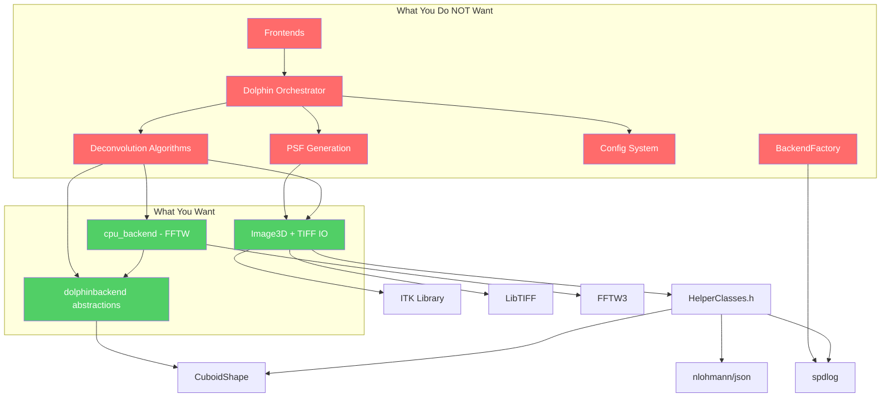
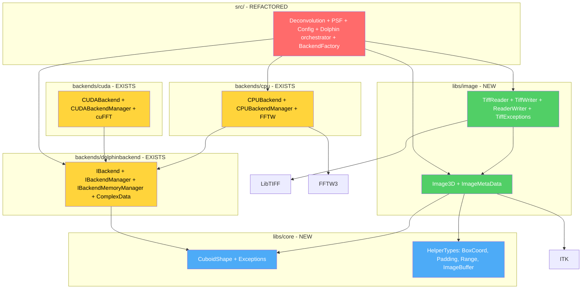

# Plan: Reusing DOLPHIN Image Handling & Backends in a New Project

## Decisions

| Question | Decision |
|----------|----------|
| Repo structure | **Separate repo** with dolphin as git submodule |
| ITK dependency | **Keep ITK** — new project also uses it |
| Backend instantiation | **Direct `CPUBackendManager`** — no `BackendFactory` needed |
| Refactoring style | **Clean architecture** — move files into proper library directories |

---

## Current Dependency Graph



## Key Findings

### Already-Separable Libraries
The backend layer is **already structured as independent CMake libraries** with their own install targets:
- [`dolphinbackend`](backends/dolphinbackend/CMakeLists.txt) — static library with `CuboidShape`, `ComplexData`, `IBackend`, `IBackendMemoryManager`, `IDeconvolutionBackend`
- [`cpu_backend`](backends/cpu/CMakeLists.txt) — static library with FFTW-based compute, depends on `dolphinbackend`
- [`cuda_backend`](backends/cuda/CMakeLists.txt) — static library with CUDA/cuFFT, depends on `dolphinbackend`

### Tangled Dependencies in Image Layer
The image handling code is **compiled into the monolithic `dolphin` static library** and has cross-cutting dependencies:

| Component | Depends On | Issue |
|-----------|-----------|-------|
| [`Image3D`](include/dolphin/Image3D.h) | ITK, [`HelperClasses.h`](include/dolphin/HelperClasses.h) | `HelperClasses.h` is a 500-line god-header mixing image types with JSON, spdlog, and deconvolution-specific types |
| [`TiffReader`](include/dolphin/IO/TiffReader.h) | ITK, LibTIFF, [`ReaderWriter`](include/dolphin/IO/ReaderWriter.h) | `ReaderWriter.h` references `PaddedImage` which is only forward-declared in deconvolution code |
| [`TiffWriter`](include/dolphin/IO/TiffWriter.h) | ITK, LibTIFF, [`ReaderWriter`](include/dolphin/IO/ReaderWriter.h) | Same `PaddedImage` issue |
| [`HelperClasses.h`](include/dolphin/HelperClasses.h) | `nlohmann/json`, `spdlog`, `CuboidShape` | Includes JSON and logging even though many types only need `CuboidShape` |
| [`BackendFactory`](include/dolphin/backend/BackendFactory.h) | `spdlog`, `cpu_backend`, `cuda_backend` | Tightly coupled to spdlog logger registry — not needed in new project |

### Naming Issue
[`IDeconvolutionBackend`](backends/dolphinbackend/include/dolphinbackend/IDeconvolutionBackend.h) is **misleadingly named** — it provides general-purpose FFT, complex arithmetic, element-wise operations, and data manipulation. These are compute primitives, not deconvolution-specific operations.

---

## Target Library Structure



---

## Implementation Steps

### Step 1: Split `HelperClasses.h` into Focused Headers

[`HelperClasses.h`](include/dolphin/HelperClasses.h) is a 500-line god-header. Split it into:

| New Header | Contents | Dependencies |
|-----------|----------|-------------|
| `dolphin/Types/BoxCoord.h` | `BoxCoord`, `BoxCoordWithPadding`, `Padding` | `CuboidShape` only |
| `dolphin/Types/ImageBuffer.h` | `ImageBuffer`, `CustomList` | `CuboidShape` only |
| `dolphin/Types/Range.h` | `Range<T>` template | None |
| `dolphin/HelperClasses.h` | **Backward-compatible wrapper** that includes all of the above + JSON + spdlog | All of above + nlohmann/json + spdlog |

This way, `Image3D` and IO code only include what they need, while existing deconvolution code still compiles via the wrapper.

### Step 2: Resolve the `PaddedImage` Dependency

`PaddedImage` is currently only forward-declared in [`Postprocessor.h`](include/dolphin/deconvolution/Postprocessor.h) but used by the IO interfaces in [`ReaderWriter.h`](include/dolphin/IO/ReaderWriter.h). 

**Action**: Define `PaddedImage` in `Image3D.h` as a simple struct — it is just an `Image3D` with padding metadata. Remove the forward declaration from deconvolution code.

### Step 3: Create `libs/core/` Directory with CMakeLists.txt

New thin static library containing just the shared types:

```
libs/core/
  ├── CMakeLists.txt
  └── include/dolphin/Types/
        ├── BoxCoord.h        (moved from HelperClasses.h)
        ├── ImageBuffer.h     (moved from HelperClasses.h)
        └── Range.h           (moved from HelperClasses.h)
```

- Depends on: `dolphinbackend` (for `CuboidShape`)
- No dependency on: ITK, LibTIFF, FFTW, nlohmann/json, spdlog

### Step 4: Create `libs/image/` Directory with CMakeLists.txt

Extract image handling into its own library:

```
libs/image/
  ├── CMakeLists.txt
  └── include/dolphin/
        ├── Image3D.h           (moved, updated includes)
        ├── ImageMetaData.h     (moved)
        ├── IO/
        │   ├── ReaderWriter.h  (moved, PaddedImage fix)
        │   ├── TiffReader.h    (moved)
        │   ├── TiffWriter.h    (moved)
        │   ├── TiffReaderWriterPair.h (moved)
        │   └── TiffExceptions.h (moved)
  └── src/
        ├── Image3D.cpp         (moved)
        ├── ImageMetaData.cpp   (moved)
        ├── TiffReader.cpp      (moved)
        ├── TiffWriter.cpp      (moved)
        └── TiffReaderWriterPair.cpp (moved)
```

- Depends on: `dolphin-core`, ITK, LibTIFF
- No dependency on: FFTW, deconvolution code, PSF code, config system

### Step 5: Move `BackendFactory` into the Main Dolphin Library

[`BackendFactory.h`](include/dolphin/backend/BackendFactory.h) is application-level orchestration that depends on spdlog logger registry. Move it from the shared include path into the main dolphin library sources. The new project will instantiate `CPUBackendManager` directly instead.

### Step 6: Update `HelperClasses.h` as Backward-Compatible Wrapper

Replace the current monolithic content with includes of the new split headers plus JSON/spdlog:

```cpp
// HelperClasses.h - backward-compatible wrapper
#include "dolphin/Types/BoxCoord.h"
#include "dolphin/Types/ImageBuffer.h"
#include "dolphin/Types/Range.h"
#include "nlohmann/json.hpp"
#include <spdlog/spdlog.h>
// ... any remaining deconvolution-specific types
```

This ensures all existing code continues to compile without changes.

### Step 7: Update Root CMakeLists.txt

Refactor [`CMakeLists.txt`](CMakeLists.txt) to use the new library structure:

```cmake
# Core types library
add_subdirectory(libs/core)

# Image handling library
add_subdirectory(libs/image)

# Backend libraries (already separate)
add_subdirectory(backends/dolphinbackend)
add_subdirectory(backends/cpu)
if(BUILD_CUDA)
    add_subdirectory(backends/cuda)
endif()

# Main dolphin library (now depends on the above)
add_library(dolphin STATIC ${DOLPHIN_SOURCES})
target_link_libraries(dolphin PUBLIC
    dolphin-image
    dolphin-core
    dolphinbackend
    cpu_backend
    # ... deconvolution-specific deps
)

# Frontends
add_subdirectory(frontends/cli)
add_subdirectory(frontends/gui)
```

### Step 8: Add CMake Install Targets and Config Files

Create `dolphin-imageConfig.cmake.in` and `dolphin-coreConfig.cmake.in` so the new project can `find_package` them after installation, similar to the existing [`dolphinbackendConfig.cmake.in`](backends/dolphinbackend/cmake/dolphinbackendConfig.cmake.in).

### Step 9: Verify DOLPHIN Still Builds and Works

After all refactoring, ensure:
- `dolphin` static library compiles
- CLI frontend works
- GUI frontend works
- Existing tests pass
- No changes to public API for deconvolution users

### Step 10: Create the New Project Repository

```
my-image-app/
├── CMakeLists.txt
├── src/
│   └── main.cpp
└── extern/
    └── dolphin/          # git submodule pointing to dolphin repo
```

```cmake
# CMakeLists.txt
cmake_minimum_required(VERSION 3.10)
project(my_image_app VERSION 1.0.0)
set(CMAKE_CXX_STANDARD 20)

# Pull in dolphin libraries
add_subdirectory(extern/dolphin)

# Disable things we dont need
set(BUILD_CUDA OFF CACHE BOOL "" FORCE)
set(ENABLE_TESTS OFF CACHE BOOL "" FORCE)

add_executable(my_app src/main.cpp)

target_link_libraries(my_app PRIVATE
    dolphin-image      # Image3D + TIFF IO
    dolphinbackend     # Backend abstractions
    cpu_backend        # FFTW compute
)
```

```cpp
// src/main.cpp
#include "dolphin/Image3D.h"
#include "dolphin/IO/TiffReader.h"
#include "dolphin/IO/TiffWriter.h"
#include "cpu_backend/CPUBackendManager.h"

int main() {
    // Read a TIFF image
    auto metadata = TiffReader::readMetadata("input.tif");
    auto image = TiffReader::readTiffFile("input.tif", 0);
    
    // Use backend compute primitives directly
    CPUBackendManager backendMgr;
    BackendConfig config{1, "cpu"};
    backendMgr.init([](const std::string& msg, LogLevel level){
        // simple logging callback
    });
    auto& backend = backendMgr.getBackend(config);
    // ... your image processing ...
    
    // Write result
    TiffWriter::writeToFile("output.tif", *image);
    return 0;
}
```

---

## Why Not Copy?

| Approach | Maintenance | Upstream Fixes | License Compliance | Effort |
|----------|------------|---------------|-------------------|--------|
| **Copy source** | Diverges immediately | Manual cherry-pick | Must track separately | Low initial, high long-term |
| **Extract libraries** (recommended) | Single source of truth | Automatic | Single LICENSE file | Medium initial, low long-term |
| **Use dolphin as-is** | Shared | Automatic | Simple | Low, but pulls in everything |

The **extract libraries** approach is the right long-term investment. It also benefits the DOLPHIN project itself by enforcing proper modularity.

---

## Optional Future Improvements

These are not required for the initial extraction but would improve the architecture:

1. **Rename `IDeconvolutionBackend`** to `IComputeBackend` — it provides general FFT/compute primitives, not deconvolution-specific operations. Keep `IDeconvolutionBackend` as a thin extension in the deconvolution library.

2. **Remove ITK dependency from `Image3D`** — replace `itk::Image` with a simpler raw-buffer representation. This is a large refactoring that would benefit projects that don't need ITK's pipeline architecture, but is out of scope for now since you also use ITK.

3. **Add JSON schema validation** to the config system — currently trusts JSON structure without validation.
