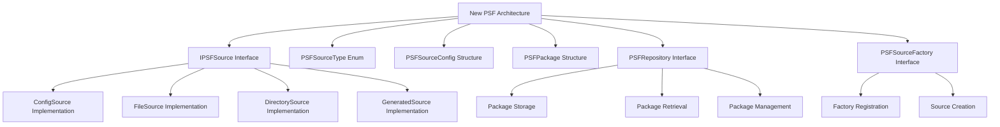

# PSF Architecture Refactoring Plan

## Overview

This document outlines the refactoring of the PSF (Point Spread Function) architecture from the current monolithic [`PSFManager`](include/PSFManager.h:20) to a modular, extensible architecture based on clear interfaces and separation of concerns.

## Current Architecture Issues

### Identified Problems:
1. **Monolithic PSFManager**: Handles file-based, directory-based, and generated PSFs in single class
2. **Hard-coded source types**: No clear abstraction for different PSF source types
3. **Tight coupling**: Direct dependencies between loading logic and PSF generation
4. **Mixed responsibilities**: Configuration loading, PSF generation, and package management intertwined
5. **Limited extensibility**: Adding new PSF sources requires modifying the core manager

### Current Methods to Refactor:
- [`PSFManager::PSFFromConfigPath()`](include/PSFManager.h:24) → Config source
- [`PSFManager::PSFFromFilePath()`](include/PSFManager.h:33) → File source  
- [`PSFManager::PSFFromDirPath()`](include/PSFManager.h:34) → Directory source
- [`PSFManager::createPSFFromConfig()`](include/PSFManager.h:29) → Generated source

## New Architecture Design



## Interface Definitions

### 1. IPSFSource Interface

**File**: `include/psf/IPSFSource.h`

```cpp
#pragma once

#include <string>
#include <vector>
#include <memory>
#include <optional>
#include "../lib/nlohmann/json.hpp"
using json = nlohmann::json;

class PSFPackage;
class PSFSourceConfig;

class IPSFSource {
public:
    virtual ~IPSFSource() = default;
    
    // Core loading method
    virtual std::unique_ptr<PSFPackage> loadPSFPackage() = 0;
    
    // Source identification
    virtual std::string getName() const = 0;
    virtual PSFSourceType getType() const = 0;
    
    // Capability checking
    virtual bool canHandle(const std::string& source) const = 0;
    
    // Configuration validation
    virtual bool validateConfiguration() const = 0;
    virtual std::vector<std::string> getValidationErrors() const = 0;
    
    // Configuration management
    virtual void setConfig(const std::shared_ptr<PSFSourceConfig>& config) = 0;
    virtual std::shared_ptr<PSFSourceConfig> getConfig() const = 0;
    
    // Metadata
    virtual std::string getLastError() const = 0;
    virtual bool isValid() const = 0;
    
    // Progress reporting (optional)
    virtual std::optional<float> getProgress() const { return std::nullopt; }
    
protected:
    mutable std::string lastError;
    std::vector<std::string> validationErrors;
};
```

### 2. PSFSourceType Enum

**File**: `include/psf/PSFSourceType.h`

```cpp
#pragma once

enum class PSFSourceType {
    Config,     // Configuration-based PSF generation
    File,       // Single file PSF loading
    Directory,  // Directory of PSF files loading
    Generated   // Programmatic PSF generation
};

const std::string toString(PSFSourceType type);
PSFSourceType fromString(const std::string& str);
```

### 3. PSFSourceConfig Structure

**File**: `include/psf/PSFSourceConfig.h`

```cpp
#pragma once

#include <string>
#include <vector>
#include <memory>
#include "../lib/nlohmann/json.hpp"
using json = nlohmann::json;
#include "PSFSourceType.h"

struct PSFSourceConfig {
    std::string sourceName;
    PSFSourceType sourceType;
    std::string sourcePath;
    
    // Configuration for different source types
    json configData;
    
    // Subimage specifications (maintain compatibility with PSFManager)
    std::vector<int> psfCubeVec;
    std::vector<int> psfLayerVec;
    
    // Optional metadata
    std::string description;
    std::vector<std::string> tags;
    
    // Serialization
    bool loadFromJSON(const json& jsonData);
    json toJSON() const;
    
    // Validation
    bool isValid() const;
    std::vector<std::string> getValidationErrors() const;
    
    // Factory methods
    static std::shared_ptr<PSFSourceConfig> createFromJSON(const json& jsonData);
    static std::shared_ptr<PSFSourceConfig> createForType(PSFSourceType type);
    
    // Error handling
    void addValidationError(const std::string& error);
    void clearValidationErrors();
    
private:
    std::vector<std::string> validationErrors;
};
```

### 4. PSFPackage Structure

**File**: `include/psf/PSFPackage.h`

```cpp
#pragma once

#include <vector>
#include <string>
#include <memory>
#include <chrono>
#include "PSF.h"

class PSFPackage {
public:
    // Main PSF data container (enhanced from current PSFManager::PSFPackage)
    std::vector<PSF> psfs;
    
    // Position mappings (maintain compatibility)
    std::vector<std::vector<int>> psfCubeVec;
    std::vector<std::vector<int>> psfLayerVec;
    
    // Package metadata
    std::string sourceName;
    PSFSourceType sourceType;
    std::chrono::system_clock::time_point loadTime;
    std::string description;
    
    // Quality and validation info
    bool isValid;
    std::vector<std::string> validationErrors;
    int warningCount;
    
    // Memory management info
    size_t memoryUsageBytes;
    
    // Lifecycle management
    void push_back(const PSFPackage& other);
    void clear();
    bool empty() const;
    size_t size() const;
    
    // Dimension validation (enhanced from PSFManager::PSFDimensionCheck)
    bool validateDimensions() const;
    std::vector<std::string> getDimensionErrors() const;
    
    // Statistics
    PSFPackage getStatistics() const;
    std::string getSummary() const;
    
    // Error handling
    void addValidationError(const std::string& error);
    void addWarning(const std::string& warning);
    
    // I/O utilities
    bool savePackage(const std::string& path) const;
    static std::unique_ptr<PSFPackage> loadPackage(const std::string& path);
    
    // Factory methods
    static std::unique_ptr<PSFPackage> createEmpty();
    static std::unique_ptr<PSFPackage> createCopy(const PSFPackage& other);
    
private:
    void updateStatistics();
    void checkMemoryUsage();
};
```

### 5. PSFRepository Interface

**File**: `include/psf/PSFRepository.h`

```cpp
#pragma once

#include <string>
#include <vector>
#include <memory>
#include <unordered_map>
#include <mutex>
#include "IPSFSource.h"
#include "PSFPackage.h"

class PSFRepository {
public:
    virtual ~PSFRepository() = default;
    
    // Package storage and retrieval
    virtual bool storePackage(const std::string& key, std::unique_ptr<PSFPackage> package) = 0;
    virtual std::unique_ptr<PSFPackage> retrievePackage(const std::string& key) = 0;
    virtual bool hasPackage(const std::string& key) const = 0;
    virtual bool removePackage(const std::string& key) = 0;
    
    // Package lifecycle management
    virtual std::vector<std::string> getAllPackageKeys() const = 0;
    virtual std::vector<std::unique_ptr<PSFPackage>> getAllPackages() = 0;
    virtual bool clearAllPackages() = 0;
    
    // Package registration from sources
    virtual bool registerSource(const std::string& key, std::shared_ptr<IPSFSource> source) = 0;
    virtual std::unique_ptr<PSFPackage> loadAndStore(const std::string& key) = 0;
    
    // Metadata and statistics
    virtual size_t getPackageCount() const = 0;
    virtual size_t getTotalMemoryUsage() const = 0;
    virtual std::vector<std::string> getPackageMetadata() const = 0;
    
    // Validation and health checks
    virtual std::vector<std::string> validateAllPackages() const = 0;
    virtual bool repositoryHealthCheck() const = 0;
    
    // Persistence
    virtual bool saveRepository(const std::string& path) const = 0;
    virtual bool loadRepository(const std::string& path) = 0;
    
    // Callbacks and observers
    virtual void setPackageLoadedCallback(std::function<void(const std::string&, const PSFPackage&)> callback) = 0;
    virtual void setPackageRemovedCallback(std::function<void(const std::string&)> callback) = 0;
    
protected:
    mutable std::mutex repositoryMutex;
    std::unordered_map<std::string, std::unique_ptr<PSFPackage>> packages_;
    std::unordered_map<std::string, std::shared_ptr<IPSFSource>> sources_;
    
    // Callbacks
    std::function<void(const std::string&, const PSFPackage&)> packageLoadedCallback;
    std::function<void(const std::string&)> packageRemovedCallback;
    
    void notifyPackageLoaded(const std::string& key, const PSFPackage& package);
    void notifyPackageRemoved(const std::string& key);
};
```

### 6. PSFSourceFactory Interface

**File**: `include/psf/PSFSourceFactory.h`

```cpp
#pragma once

#include <string>
#include <vector>
#include <memory>
#include <functional>
#include <unordered_map>
#include "IPSFSource.h"
#include "PSFSourceType.h"
#include "PSFSourceConfig.h"

class PSFSourceFactory {
public:
    using SourceCreator = std::function<std::shared_ptr<IPSFSource>(const std::shared_ptr<PSFSourceConfig>&)>;
    
    static PSFSourceFactory& getInstance() {
        static PSFSourceFactory instance;
        return instance;
    }
    
    // Factory registration
    void registerSourceType(PSFSourceType type, SourceCreator creator, const std::string& typeName);
    void registerSourceTypeName(const std::string& typeName, PSFSourceType type);
    
    // Source creation
    std::shared_ptr<IPSFSource> createSource(PSFSourceType type, const std::shared_ptr<PSFSourceConfig>& config);
    std::shared_ptr<IPSFSource> createSource(const std::string& typeName, const std::shared_ptr<PSFSourceConfig>& config);
    std::shared_ptr<IPSFSource> createSourceFromJSON(const json& jsonData);
    
    // Type management
    std::vector<PSFSourceType> getAvailableTypes() const;
    std::vector<std::string> getAvailableTypeNames() const;
    bool isTypeRegistered(PSFSourceType type) const;
    bool isTypeNameRegistered(const std::string& typeName) const;
    
    // Information about registered types
    std::string getTypeName(PSFSourceType type) const;
    PSFSourceType getFromString(const std::string& typeName) const;
    
    // Configuration assistance
    std::shared_ptr<PSFSourceConfig> createDefaultConfig(PSFSourceType type) const;
    std::shared_ptr<PSFSourceConfig> createConfigFromJSON(const json& jsonData) const;
    
private:
    PSFSourceFactory();
    
    std::unordered_map<PSFSourceType, SourceCreator> sourceCreators_;
    std::unordered_map<PSFSourceType, std::string> typeNames_;
    std::unordered_map<std::string, PSFSourceType> nameToType_;
    
    // Initialize default sources
    void registerDefaultSources();
};

// Compatibility namespace for backward migration
namespace PSFSourceFactoryCompat {
    inline std::shared_ptr<IPSFSource> CreateSourceFromConfig(const json& configData);
    inline std::shared_ptr<IPSFSource> CreateSourceFromFile(const std::string& filePath);
    inline std::shared_ptr<IPSFSource> CreateSourceFromDirectory(const std::string& dirPath);
}
```

## Migration Strategy

### Phase 1: Interface Creation (This Task)
- Create all interface definitions and structures
- Implement basic validation and error handling
- Add comprehensive documentation

### Phase 2: Implementation Classes
- Implement concrete source classes (ConfigSource, FileSource, DirectorySource, GeneratedSource)
- Implement concrete repository class
- Implement factory with default registrations

### Phase 3: Migration Integration  
- Modify PSFManager to use new architecture gradually
- Add fallback to existing functionality
- Integration testing with existing tests

### Phase 4: Deprecation and Cleanup
- Mark old PSFManager methods as deprecated
- Update documentation and examples
- Remove legacy components after stability verification

## Backward Compatibility Strategy

### Key Compatibility Points:
1. **PSFPackage Structure**: Maintains `psfs`, `psfCubeVec`, `psfLayerVec` fields
2. **Configuration Loading**: JSON structure remains compatible
3. **File I/O**: Existing TIFF loading/saving methods preserved
4. **Validation**: Enhanced version of existing dimension checking

### Migration Path:
```cpp
// Old usage
PSFManager manager;
PSFPackage package = manager.PSFFromConfigPath(path);

// New usage  
auto sourceFactory = PSFSourceFactory::getInstance();
auto config = PSFSourceConfig::createFromJSON(configData);
auto source = sourceFactory.createSource(PSFSourceType::Config, config);
auto package = source->loadPSFPackage();
```

## Testing Strategy

### Unit Tests:
- Interface compliance for all abstract classes
- Configuration validation testing
- Package lifecycle management
- Error handling and edge cases

### Integration Tests:
- Source-to-package workflow testing
- Repository persistence and retrieval
- Factory registration and creation
- Cross-source compatibility

### Performance Tests:
- Large PSF loading performance
- Memory usage optimization
- Parallel loading capabilities
- Repository scalability

## Quality Metrics

### Maintainability:
- Single Responsibility Principle adherence
- Clear interface contracts
- Comprehensive documentation
- Extensive error handling

### Extensibility:
- Plugin architecture for new source types
- Factory pattern for dynamic creation
- Configuration-driven behavior
- Clean separation of concerns

### Performance:
- Lazy loading support
- Memory-efficient storage
- Caching mechanisms
- Parallel processing capabilities

### Reliability:
- Comprehensive validation
- Graceful error handling
- Transaction-like behavior
- Consistent state management

## Usage Examples

### Basic Usage Pattern

```cpp
// Example 1: Loading a PSF from a configuration file
#include <psf/PSFSourceFactory.h>
#include <psf/PSFRepository.h>

// Create PSF source from configuration
auto factory = PSFSourceFactory::getInstance();
auto config = PSFSourceConfig::createFromJSON(configJson);
auto source = factory->createSource(PSFSourceType::Config, config);

// Load PSF package
auto package = source->loadPSFPackage();
if (package->isValid()) {
    // Use the PSFs in the package
    for (const auto& psf : package->psfs) {
        // Process PSF
    }
}

// Example 2: Using the repository for PSF management
auto repo = std::make_unique<PSFRepository>();
repo->storePackage("main_psf", std::move(package));

// Later in the application
auto loadedPackage = repo->retrievePackage("main_psf");
if (loadedPackage) {
    // Use cached PSF package
}
```

### Advanced Usage with Error Handling

```cpp
// Example 3: Robust PSF loading with comprehensive error handling
std::unique_ptr<PSFPackage> safeLoadPSF(const std::string& sourceConfig) {
    try {
        auto factory = PSFSourceFactory::getInstance();
        auto config = PSFSourceConfig::createFromJSON(sourceConfig);
        
        // Validate configuration
        if (!config->isValid()) {
            std::cerr << "Invalid configuration: ";
            for (const auto& error : config->getValidationErrors()) {
                std::cerr << error << "; ";
            }
            return nullptr;
        }
        
        // Create source and validate it handles the type
        auto source = factory->createSource(config->sourceType, config);
        if (!source->canHandle(config->sourcePath)) {
            std::cerr << "Source cannot handle: " << config->sourcePath << std::endl;
            return nullptr;
        }
        
        // Load with validation
        auto package = source->loadPSFPackage();
        if (!package->isValid()) {
            std::cerr << "Failed to load PSF package" << std::endl;
            return nullptr;
        }
        
        return package;
        
    } catch (const std::exception& e) {
        std::cerr << "PSF loading failed: " << e.what() << std::endl;
        return nullptr;
    }
}
```

### Migrating from PSFManager

```cpp
// Example 4: Migration path from old PSFManager to new architecture
// Old code:
// PSFManager manager;
// PSFPackage package = manager.PSFFromConfigPath(configPath);

// New equivalent code:
auto factory = PSFSourceFactory::getInstance();
auto config = PSFSourceConfig::createForType(PSFSourceType::Config);
config->sourcePath = configPath;
config->configData = Config::loadJSONFile(configPath);

auto source = factory->createSource(PSFSourceType::Config, config);
auto package = source->loadPSFPackage();

// Example 5: Batch processing multiple PSF sources
std::vector<std::unique_ptr<PSFPackage>> loadMultiplePSFs(
    const std::vector<std::string>& configPaths
) {
    std::vector<std::unique_ptr<PSFPackage>> packages;
    auto factory = PSFSourceFactory::getInstance();
    
    for (const auto& path : configPaths) {
        try {
            auto config = PSFSourceConfig::createFromJSON(Config::loadJSONFile(path));
            auto source = factory->createSource(config->sourceType, config);
            auto package = source->loadPSFPackage();
            
            if (package->isValid()) {
                packages.push_back(std::move(package));
            }
        } catch (const std::exception& e) {
            std::cerr << "Failed to load " << path << ": " << e.what() << std::endl;
        }
    }
    
    return packages;
}
```

### Custom Source Implementation

```cpp
// Example 6: Creating a custom PSF source
#include <psf/IPSFSource.h>

class CustomPSFSource : public IPSFSource {
public:
    std::unique_ptr<PSFPackage> loadPSFPackage() override {
        auto package = std::make_unique<PSFPackage>();
        
        // Custom loading logic
        // ...
        
        package->isValid = true;
        package->sourceName = "custom";
        package->sourceType = PSFSourceType::File;
        
        return package;
    }
    
    std::string getName() const override { return "CustomPSFSource"; }
    PSFSourceType getType() const override { return PSFSourceType::File; }
    
    bool canHandle(const std::string& source) const override {
        return source.ends_with(".custom_psf");
    }
    
    bool validateConfiguration() const override {
        // Custom validation logic
        return true;
    }
    
    std::vector<std::string> getValidationErrors() const override {
        return validationErrors;
    }
    
    void setConfig(const std::shared_ptr<PSFSourceConfig>& config) override {
        this->config = config;
    }
    
    std::shared_ptr<PSFSourceConfig> getConfig() const override {
        return config;
    }
    
    std::string getLastError() const override { return lastError; }
    bool isValid() const override { return true; }

private:
    std::shared_ptr<PSFSourceConfig> config;
};

// Registration with factory
auto& factory = PSFSourceFactory::getInstance();
factory.registerSourceType(
    PSFSourceType::File,
    [](const std::shared_ptr<PSFSourceConfig>& config) {
        return std::make_unique<CustomPSFSource>();
    },
    "CustomFile"
);
```

## Integration Points

### With Current Architecture

```cpp
// Integration with existing PSFManager (Phase 3 approach)
class EnhancedPSFManager {
private:
    std::unique_ptr<PSFRepository> repository_;
    std::unique_ptr<PSFSourceFactory> factory_;
    
public:
    // Legacy method support with delegation
    PSFPackage PSFFromConfigPath(const std::string& psfConfigPath) {
        auto config = PSFSourceConfig::createForType(PSFSourceType::Config);
        config->sourcePath = psfConfigPath;
        config->configData = loadJSONFile(psfConfigPath);
        
        auto source = factory_->createSource(PSFSourceType::Config, config);
        return source->loadPSFPackage();
    }
    
    // New method using enhanced architecture
    std::unique_ptr<PSFPackage> loadEnhancedPSF(const std::shared_ptr<PSFSourceConfig>& config) {
        auto source = factory_->createSource(config->sourceType, config);
        auto package = source->loadPSFPackage();
        repository_->storeSource(config->sourceName, std::move(package));
        return repository_->retrievePackage(config->sourceName);
    }
};
```

## Performance Considerations

### Memory Management
- PSFPackage uses smart pointers for proper memory management
- Repository implements cache eviction policies
- Lazy loading support for large PSF collections

### Concurrency Support
- Thread-safe repository operations
- Parallel loading of multiple PSF sources
- Optimized for read-heavy workloads

### Scalability Features
- Configurable cache sizes
- Automatic cleanup of invalid packages
- Progress reporting for long-running operations

## Validation and Error Handling

### Comprehensive Validation
- Configuration schema validation
- PSF dimension consistency checking
- File format and path validation
- Memory usage limits

### Error Reporting
- Detailed error messages with context
- Warning system for recoverable issues
- Graceful degradation on failures
- Comprehensive logging support

## Future Extensibility

### Plugin Architecture
- Dynamic source registration
- Runtime type discovery
- Configuration schema evolution
- Version migration support

### Performance Optimizations
- GPU acceleration for PSF generation
- Distributed loading for large datasets
- Parallel PSF processing
- Adaptive caching strategies

### Advanced Features
- PSF quality metrics
- Batch processing pipelines
- Integration with visualization tools
- Automated validation workflows